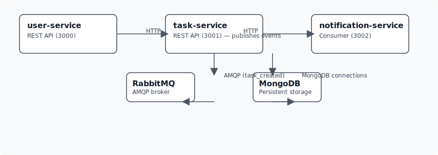

- 



**Project Overview**
- A small Node.js microservices demo implementing a simple User / Task / Notification system.
- Built as separate services (user-service, task-service, notification-service) communicating via RabbitMQ and persisting data in MongoDB.
- Purpose: demonstrate microservice patterns, message-driven events, Docker Compose setup, and clean, testable APIs — suitable to show to recruiters.

**Architecture**
- `user-service`: CRUD users (port 3000)
- `task-service`: CRUD tasks and emits `task_created` events (port 3001)
- `notification-service`: consumes `task_created` events from RabbitMQ and logs notifications (port 3002)
- `mongo`: central MongoDB instance used by `user-service` and `task-service`
- `rabbitmq`: message broker used for event-driven communication

**Tech Stack**
- Node.js + Express
- Mongoose (MongoDB ODM)
- RabbitMQ (AMQP) for events
- Docker + Docker Compose for local orchestration

**Quickstart (Docker Compose)**
1. From the repo root run:

```bash
docker compose up --build
```

2. Services will be available at:
- User Service: http://localhost:3000
- Task Service: http://localhost:3001
- Notification Service: http://localhost:3002
- RabbitMQ management (if enabled): http://localhost:15672 (guest/guest)

**Run locally (without Docker)**
1. Install dependencies for each service, for example:

```bash
cd user-service
npm install
npm start
```

2. Ensure a MongoDB instance is running and reachable; update environment variables if needed.

**Environment variables**
- `MONGO_URL` — connection string for MongoDB (example: `mongodb://mongo:27017/Users`)
- `RABBITMQ_URL` — AMQP connection string for RabbitMQ (example: `amqp://rabbitmq:5672`)

**APIs (examples)**

- Create user (User Service)

```bash
curl -X POST http://localhost:3000/users \
  -H "Content-Type: application/json" \
  -d '{"name":"Alice","email":"alice@example.com"}'
```

- List users

```bash
curl http://localhost:3000/users
```

- Create task (Task Service) — this publishes a `task_created` event that the Notification Service consumes

```bash
curl -X POST http://localhost:3001/tasks \
  -H "Content-Type: application/json" \
  -d '{"title":"Do homework","description":"Math exercises","userId":"<userId>"}'
```

- List tasks

```bash
curl http://localhost:3001/tasks
```

**Logging & Observability**
- Each service includes console logging for incoming requests and key events (e.g., created tasks, published messages, consumed messages). Logs are written to stdout so they can be collected by container logging systems when run in Docker.

**Persistence & Data**
- MongoDB stores users and tasks in separate databases (`Users`, `Tasks` in the current Compose setup). Data persists to the `mongo-data` Docker volume when using Docker Compose.

**Possible improvements / next steps**
- Add input validation with a library (Joi / Zod) and improve error responses.
- Add unit and integration tests for each service (Jest / Supertest).
- Add structured logging and request tracing (winston/pino + OpenTelemetry).
- Add CI/CD config (GitHub Actions) to run tests and build images.
- Add authentication/authorization for APIs (JWT / OAuth).

**Repository layout**
- `user-service/` — user API (src, package.json)
- `task-service/` — task API which publishes events
- `notification-service/` — consumer of task events
- `docker-compose.yml` — orchestrates services, MongoDB, RabbitMQ


